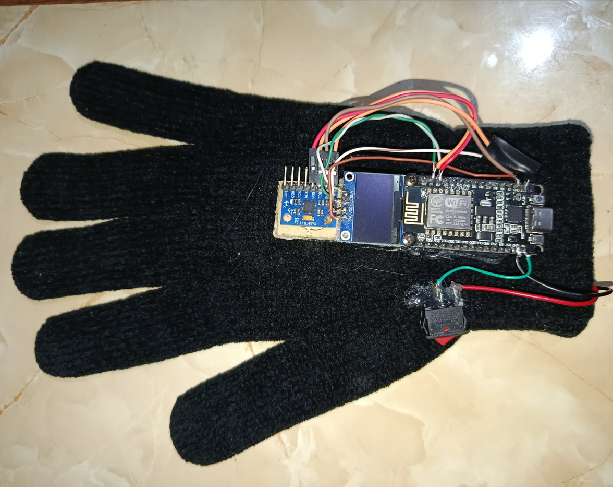
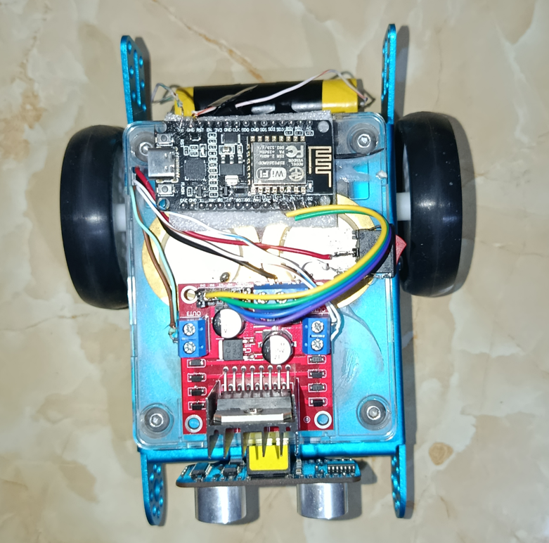

<div align="center">

# Gesture Controlled Car 
### ESP8266 & ESP-NOW


*Un vehículo robótico de alta maniobrabilidad controlado por gestos de la mano, con comunicación directa MAC a MAC y arquitectura anti-latencia.*

</div>

---

## Sobre el Proyecto

Este proyecto implementa un vehículo robótico controlado íntegramente por movimientos biomecánicos. Utiliza dos microcontroladores **ESP8266** que se comunican de forma directa y con latencia ultrabaja mediante el protocolo **ESP-NOW**, eliminando por completo la necesidad de módulos de radio adicionales (como NRF24L01) o routers Wi-Fi externos.

El sistema se divide en dos nodos principales:

1. **Transmisor (Guante):** Detecta la inclinación de la mano, procesa el vector de movimiento y envía la instrucción. Cuenta con retroalimentación visual OLED.  
   

2. **Receptor (Vehículo):** Interpreta el gesto inalámbrico y acciona un sistema de tracción diferencial.  
   


---

## Características Destacadas

- **Baja Latencia (ESP-NOW)⚡:** Frecuencia de envío ajustada y comunicación síncrona para mantener un control mecánico fluido y en tiempo real.
- **Optimización de Interfaz (I2C)🧠:** La pantalla OLED en el guante emplea un algoritmo asíncrono; solo se redibuja cuando cambia el gesto, liberando el 93% de la carga del procesador.
- **Sistema Failsafe Integrado 🛡️:** Un "perro guardián" (watchdog) de software que detiene los motores instantáneamente si se pierde la comunicación por más de 500 ms, previniendo colisiones.

---

## Tecnologías y Hardware

### Hardware Principal
| Componente | Descripción |
| :--- | :--- |
| **Microcontroladores** | 2x ESP8266 (NodeMCU / Wemos D1 Mini) |
| **Sensores** | 1x MPU6050 (Acelerómetro + Giroscopio de 6 ejes) |
| **Visualización** | 1x Pantalla OLED SSD1306 (128x64) I2C |
| **Actuadores** | 1x Driver Puente H L298N + 4 Motores DC |
| **Alimentación** | Baterías Li-ion 3.7V (Lógica) + 4x AA 1.5V (Potencia) |

### Software y Librerías
- **Entorno:** Arduino IDE
- **Librerías C++:** `ESP8266WiFi`, `espnow`, `Wire`, `MPU6050`, `Adafruit_GFX`, `Adafruit_SSD1306`
- **Análisis de Datos:** Python 3.x (Matplotlib, Numpy)

---

## Gestos Reconocidos

El sensor lee los ejes de inclinación y los traduce a los siguientes comandos de conducción:

* `F` ➔ **Adelante** (Inclinación frontal)
* `B` ➔ **Atrás** (Inclinación hacia atrás)
* `L` ➔ **Izquierda** (Inclinación lateral izquierda)
* `R` ➔ **Derecha** (Inclinación lateral derecha)
* `S` ➔ **Stop** (Posición neutra o reposo)

---

## Estructura del Repositorio

```text
📦 gesture-sheep-Cart
 ┣ 📂 code
 ┃ ┣ 📂 get_mac_address
 ┃ ┃ ┗ 📜 get_mac_address.ino      # Utilidad para obtener la MAC del receptor
 ┃ ┣ 📂 receiver_car
 ┃ ┃ ┗ 📜 receiver_car.ino         # Firmware del vehículo y control L298N
 ┃ ┗ 📂 transmitter_glove
 ┃ ┃ ┗ 📜 transmitter_glove.ino    # Firmware del MPU6050, OLED y envío
 ┣ 📂 test
 ┃ ┣ 📜 eficiencia_i2c.py          # Script para modelar saturación I2C
 ┃ ┗ 📜 grafica_latencia_real.py   # Simulación de respuesta y tiempo de ciclo
 ┣ 📂 src
 ┃ ┗ 📜 main.tex                   # Código fuente LaTeX del informe formal
 ┣ 📂 output
 ┃ ┗ 📜 informe.pdf                # (Directorio de salida para la documentación)
 ┗ 📜 requirements.txt             # Dependencias de de Python para los tests
```

## Guía de Instalación y Uso
### 1. Preparar el Entorno de Análisis (Opcional)
Si deseas ejecutar los modelos computacionales en Python, instala las dependencias:
Bash
pip install -r requirements.txt
### 2. Obtener la dirección MAC del Receptor
Para que el guante sepa a qué vehículo hablarle, necesitas la dirección de red de la placa del carro.
1.	Conecta por USB el ESP8266 que usarás en el vehículo.
2.	Sube el código `code/get_mac_address/get_mac_address.ino`.
3.	Abre el Monitor Serial a 115200 baudios y anota la dirección MAC impresa.
### 3. Configurar el Transmisor (Guante)
1.	Abre `code/transmitter_glove/transmitter_glove.ino`.
2.	Busca la variable `receiverAddress[]` y actualízala con la MAC de tu vehículo:
``` C++
// Ejemplo:
uint8_t receiverAddress[] = {0x24, 0xD7, 0xEB, 0xEF, 0xA3, 0xC8};
```

3.	Verifica las conexiones físicas I2C del MPU6050 y la OLED (`SDA: D2`, `SCL: D1`).
4.	Sube el firmware a la placa del guante.
### 4. Configurar el Receptor (Vehículo)
1.	Abre `code/receiver_car/receiver_car.ino`.
2.	Verifica que los pines declarados coincidan con el cableado físico hacia tu driver L298N:
o	`IN1 = D1`
o	`IN2 = D2`
o	`IN3 = D3`
o	`IN4 = D4`
3.	Sube el firmware a la placa del vehículo.
## Análisis y Gráficas de Rendimiento
Puedes evaluar y visualizar la eficacia arquitectónica del código optimizado frente a un algoritmo tradicional corriendo los scripts de prueba ubicados en la carpeta `/test`:
```Bash
# Genera la comparativa de carga en el bus I2C
python test/eficiencia_i2c.py

# Genera el gráfico de latencia de ejecución
python test/grafica_latencia_real.py
```

## 📄 Documentación

Puedes descargar el informe completo aquí:  
[ESP_NOW_Gesture_Car.pdf](output/ESP_NOW_Gesture_Car.pdf)

<p align="center">
  <a href="output/ESP_NOW_Gesture_Car.pdf">
    
  </a>
</p>


> **Nota: Las gráficas resultantes .png demuestran un incremento en la frecuencia de muestreo de hasta 10x y una reducción del 93% en el cuello de botella gráfico.**
